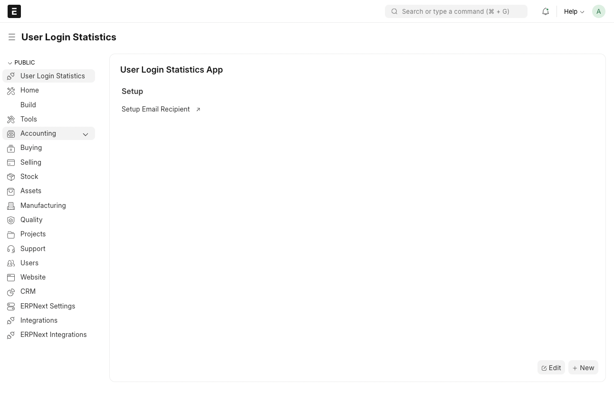
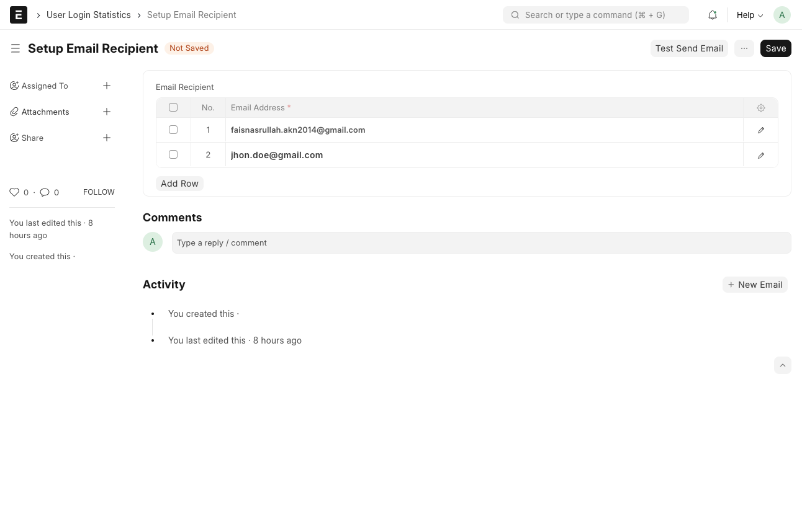

## User Login Statistics

Frappe custom app that automatically generates and sends a daily CSV file containing user login statistics via email.

---

## **Features**
- Retrieves user login statistics (first name, last name, and number of login attempts).
- Generates a CSV file with the collected data.
- Sends the CSV file to predefined email recipients once per day.
- Uses ERPNext built-in email mechanisms and scheduler.

---

## **Installation**

### Prerequisites
1. **ERPNext Setup**:
   - Ensure you have a working ERPNext instance installed. If not, follow the [ERPNext Installation Guide](https://frappeframework.com/docs/user/en/installation).

2. **Email Configuration**:
   - Configure an **Email Domain** and **Email Account** in ERPNext for sending emails. Refer to the [Email Setup Guide](https://docs.frappe.io/erpnext/user/manual/en/email).

---
### Step 1: Install the App
1. **Clone the App**:
   ```bash
   bench get-app user_login_stats https://github.com/faisnasrullah/user_login_stats --branch develop

2. **Install the App on Your Site**:
   ```bash
   bench --site [your_site_name] install-app user_login_stats

3. **Enable Scheduler**:
   ```bash
   bench --site [your_site_name] enable-scheduler

4. **Migrate the Site**:
   ```bash
   bench --site [your_site_name] migrate

### Step 2: Setup Email Recipient
**Access Setup Email Recipient**
   - In workspace, select `User Login Statistics`.
   - Choose `Setup Email Recipient`.
   - Alternatively, type `Setup Email Recipient` in the Search Awesome Bar.



**Add Email Recipients**
   - In the Email Recipient list, add the email addresses that will receive the daily CSV file.
   - Then click the `Test Send Email` button to ensure the email configuration is working.



---

### Step 3: Test the App
1. **Run the Script Manually**:
   ```bash
   bench --site [your_site_name] execute user_login_stats.user_login_statistics.utils.daily_login_stats.daily_login_stats

2. Test from doctype `Setup Email Recipient` then click the `Test Send Email` button.

---

### License MIT